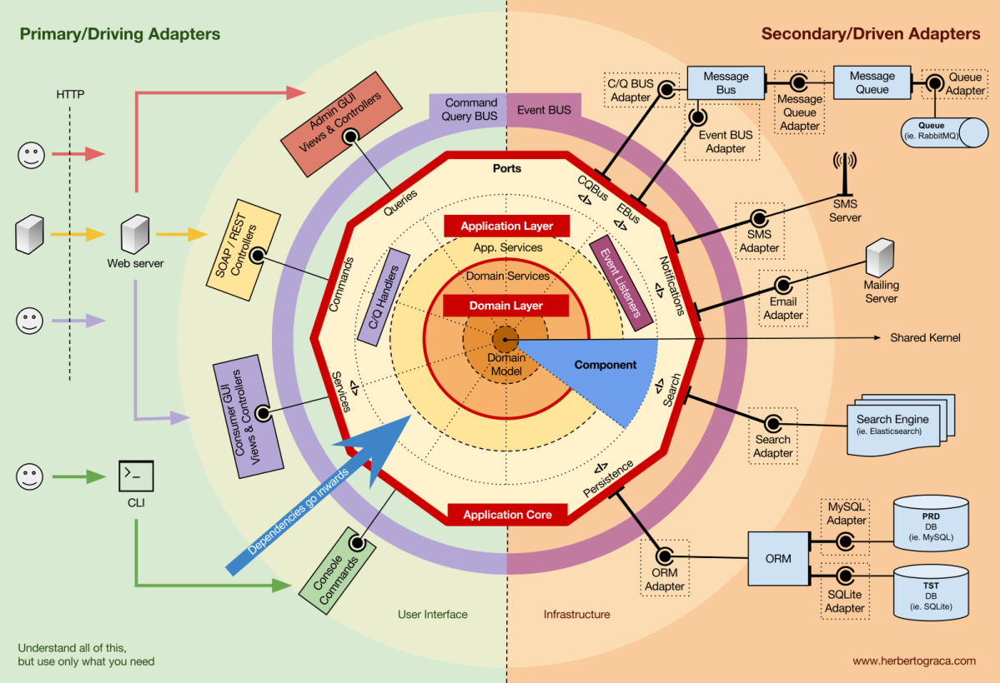
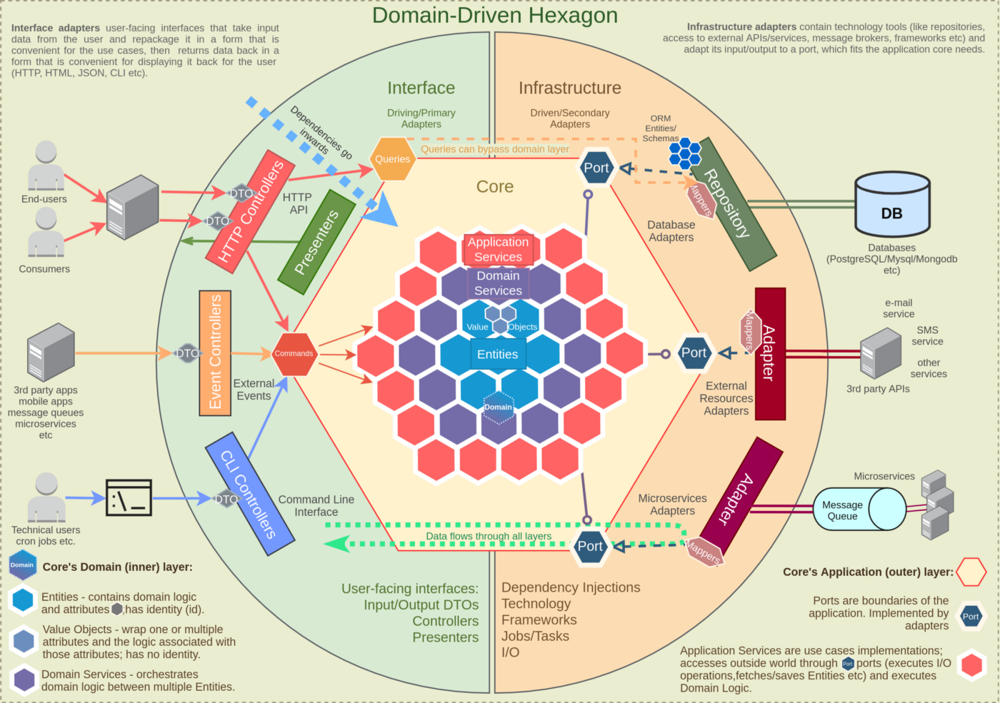

# Loans Modulith (example repository for providing loans)

This repository represents a reference template for building a modular monolith application with strict boundaries
between **each** business domain and its infrastructure. These boundaries are verified and enforced by Spring Modulith
tests. Following this template makes easier the split of domain module into single deployable (micro)service if needed in the future.
Template tends to be minimal and does not enforce any extra logic like CQRS, Event Sourcing, etc.

## Applied architectural patterns

### Domain Driven Design

We modularize the code based on business domains. For each business domain we create a separate module/package/component with its
own domain model and corresponding other layers.

**Java packages based on domain:**
- `com.example.loans.contract.domain` - contract domain - `@Entity [DDD]`, `@ValueObject [DDD]`, `@Repository [DDD]`
- `com.example.loans.contract.*` - other packages related to layers based on the selected architecture
- `com.example.loans.document.*` - (document domain + other packages related to layers based on the selected architecture)`
- `com.example.loans.insurance.*` - (insurance domain + other packages related to layers based on the selected architecture)`

### Onion Architecture

Innermost layers are independent of outer layers. The core layers are divided into 3 rings:
- **Domain Ring** – Java business domain model + basic model validations / operations on top of given domain – `@DomainRing [ONION]`,
  might be devided into `@DomainModelRing [ONION]` and `@DomainServiceRing [ONION]`
- **Application Ring** – Orchestration/workflow of current domain or other dependant domains – `@ApplicationRing [ONION]` or `@ApplicationServiceRing [ONION]`
- **Infrastructure Ring** – External interfaces, integrations like REST APIs, JPA, etc. – `@InfrastructureRing [ONION]`

**Java packages for contract domain:**
- `com.example.loans.contract.domain`
- `com.example.loans.contract.application`
- `com.example.loans.contract.infrastructure`

### Hexagonal Architecture

Puts inputs and outputs at the edges of design, divides infrastructure layer of onion architecture. 
Business logic does not depend on whether we expose a REST or a SOAP API, and it does not depend on where we get data
from – a database, a microservice API exposed via SOAP or REST.

Plays an integral role if we would want to split our monolith into external (micro)services. In such cases we
can only replace our adapters and not the whole application logic when using common Layered/N-tiered architecture.

**We recognize:**
- **Ports and adapters** – The interface used to inverse the dependency is the port while the implementation of the
  interface is the adapter. This is the simplest explanation and also the wrong, opinionated as we have to distinguish
  what use case, what type of adapter / port we have! Ports are not always interfaces and Adapters are not always their 
- implementations.
- **Primary, driving or inbound ports**
  - What the domain can do, what services it exposes to the outside world – `@PrimaryPort [HEXAGONAL]`
  - Primary port can be a class implementing some use case while Primary Adapter uses this class.
  - Primary port might be also an abstract class, interface where adapter implements this interface.
  - All this means that primary port is simply just only our entry point to the application services and marks the input boundary.
  - Having primary port as a class is fine because having multiple implementations for the same inbound API in same version
    does not make sense which means that Java interface is just only a code boilerplate.
- **Secondary, driven or outbound ports** 
  - What services must exist for the domain to do its job – `@SecondaryPort [HEXAGONAL]`
  - Secondary port must be an interface while Secondary adapter its implementation to inverse the dependency
  - Eg. we might have ports for storing domain into storage, 
- **Adapters**
  - Glues the technology to fulfill our use cases - `@(Primary|Secondary)Adapter [HEXAGONAL]`

**Java packages examples for contract domain infrastructure:**
- `com.example.loans.contract.infrastructure.inbound.java` - Java Adapter for modulith purposes
- `com.example.loans.contract.infrastructure.inbound.rest` - to expose REST API - `@RestController`
- `com.example.loans.contract.infrastructure.inbound.soap` - to expose SOAP API - `@Endpoint`
- `com.example.loans.contract.infrastructure.inbound.rabbit` - RabbitMQ drivers and listeners
- `com.example.loans.contract.infrastructure.inbound.kafka` - Kafka drivers and consumers
- `com.example.loans.contract.infrastructure.outbound.document` - Connector with document domain (in modulith can integrate via Java inbound)
- `com.example.loans.contract.infrastructure.outbound.ticket` - Connector with ticket domain
- `com.example.loans.contract.infrastructure.outbound.jpa` - JPA, Hibernate, Spring Data
- `com.example.loans.contract.infrastructure.outbound.rabbit` - RabbitMQ drivers and publishers
- `com.example.loans.contract.infrastructure.outbound.kafka` - Kafka drivers and publishers

### Modular

Code is divided into modules based on its business domain and its purpose. We distinguish between 2 types of modules:
- **Maven modules**
    - We create **new module for its purpose, NOT business domain**, mainly when:
        - We need to integrate new technology which needs some extra Maven dependency which is not required by other application layers.
        - Usually when we need to integrate with some external system, database, web service, etc.
        - Usually only **for infrastructure** ring – `InfrastructureRing [ONION]`
    - We tend to have as little as possible of such modules
        - To preserve the readability of source code by having domains in IDE close together as possible – "on one stack"
        - Improves the responsiveness of IDE
    - We DO NOT create new module for:
        - Domain / application rings (`@DomainRing [ONION]`, `@ApplicationRing [ONION]`)
        -  `@(Primary|Secondary)Port [HEXAGONAL]`).
- **Spring Modulith**
    - We create **new module for its business domain**
        - Usually for **domain / application ring** (`@DomainRing [ONION]`, `@ApplicationRing [ONION]`, `@(Primary|Secondary)Port [HEXAGONAL]`).

### All together
- **Component (blue piece of pie)** – Spring Modulith / Maven modules
- **Domain layer (brown and orange rings)** – Domain ring `@DomainRing [ONION]`, brown circle – `@DomainModelRing`,
  orange circle – `@DomainServiceRing`, contains secondary ports – `@SecondaryPort [HEXAGONAL]`
- **Application layer (yellow rings)** – Java application services `@ApplicationRing [ONION]` or `@ApplicationServiceRing [ONION]`,
  contains primary ports – `@PrimaryPort [HEXAGONAL]`
- **Infrastructure layer (green and orange outer layer)** – Java application services `@ApplicationRing [ONION]` or `@ApplicationServiceRing [ONION]`,
  contains primary adapters – `@PrimaryAdapter [HEXAGONAL]` and secondary adapters – `@SecondaryAdapter [HEXAGONAL]`

## Applied coding patterns

- **Domain model, domain services, application services are not allowed to communicate with other domains directly**
  - Each domain communicate with each ONLY via theirs ports and adapters
- Create **Java interfaces by design only for ONION and HEXAGONAL layers**
    - Java interfaces for Application and Domain Services are not needed in the most cases
        - They are adding non-necessary boilerplate code
        - Add them only when needed eg. for mocking in some advanced unit tests, usually not needed in tests
- Do not re-use domain objects across multiple domains, not all data is needed to satisfy some business requirement,
  use only objects which are fully populated and validated with attributes what are needed, do not afraid of copies,
  document domain will contain `Document`, contract domain will contain `ContractDocument` with attributes needed for contract,
  client domain will contain `ClientDocument` with attributes needed to client and not with all attributes of Document etc...
- Sharing of domain packages between domains is forbidden, each domain has its own domain model and services
- Application services are allowed to use domain objects from other domains when needed

## How to extract a deployable (micro)service from this repository

## References
- [Monolith First (Martin Fowler)](https://martinfowler.com/bliki/MonolithFirst.html)
- [Adopting Domain-First Thinking in Modular Monolith with Hexagonal Architecture](https://itnext.io/adopting-domain-first-thinking-in-modular-monolith-with-hexagonal-architecture-f9e4921ac18d?sk=9364f2aac410c7b72e75e189bfa240e9)
- [DDD, Hexagonal, Onion, Clean, CQRS, … How I put it all together](https://herbertograca.com/2017/11/16/explicit-architecture-01-ddd-hexagonal-onion-clean-cqrs-how-i-put-it-all-together/)
- [jMolecules – Architectural abstractions for Java](https://github.com/xmolecules/jmolecules)
- [Spring Modulith](https://docs.spring.io/spring-modulith/reference/index.html)